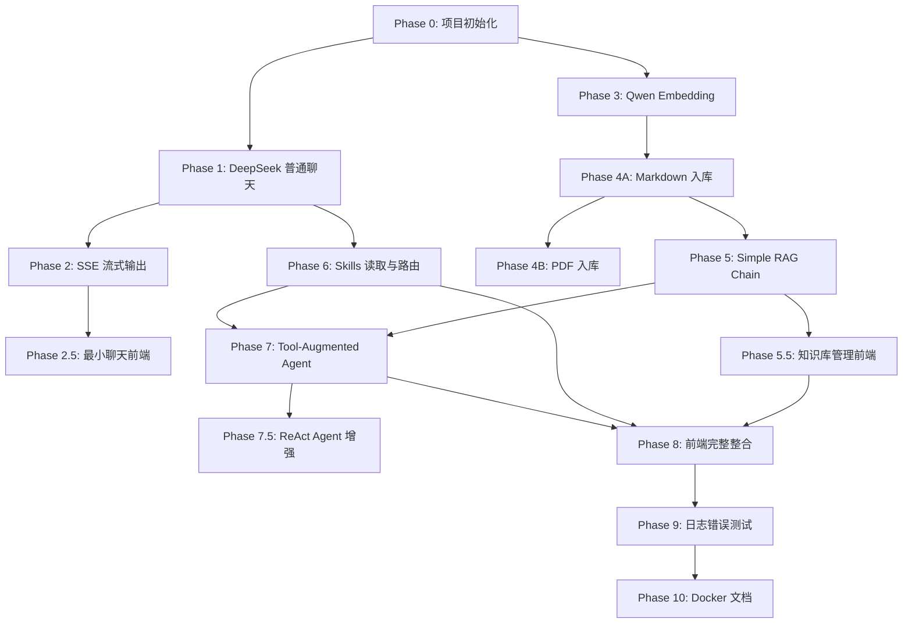

# Eino 本地知识库 Agent 开发计划

## 0. 文档目标

本计划用于指导一个由 Eino 框架驱动的本地知识库 Agent 网站开发。项目目标是：用户通过 Vue 前端发起提问，Gin 后端通过 Eino 编排 DeepSeek ChatModel、Qwen Embedder、本地知识库检索器与 Skills 读取工具，最终实现基于本地 Markdown/PDF 知识库和任务 Skills 的流式 Agent 问答系统。

本计划强调工程落地，优先完成最小闭环，再逐步扩展 PDF、Skills、工具调用、ReAct Agent、混合检索、rerank、多用户与 MCP。

---

## 1. 架构总览

```text
用户浏览器
  ↓
Vue 前端
  ↓ fetch + ReadableStream / HTTP
Gin 后端
  ↓
ChatService
  ↓
Eino Agent Runner / RAG Chain
  ├── DeepSeek ChatModel
  ├── Qwen Embedder
  ├── Knowledge Retriever
  ├── Skill Router
  ├── Skill Reader Tool
  ├── Knowledge Search Tool
  └── Prompt Builder
        ↓
本地存储
  ├── data/docs/       # Markdown / PDF 原始知识库
  ├── data/skills/     # Skills 目录
  ├── vector_db/       # MVP 阶段可用 SQLite 存向量
  └── metadata_db/     # SQLite，后续可替换 PostgreSQL
```

核心原则：

1. DeepSeek 负责对话、推理和工具调用。
2. Qwen Embedding 负责文本向量化。
3. Markdown/PDF 是普通知识库，走解析、切分、Embedding、向量检索。
4. Skills 是任务规范和操作流程，不进入普通知识库向量索引。
5. MVP 先做 Simple RAG Chain，不一开始直接上完整 ReAct Agent。
6. LLM、Embedding、VectorStore、SkillReader 都必须通过接口或封装层隔离，避免业务代码直接绑定具体实现。

---

## 2. 技术栈

| 层级 | 技术选型 |
|---|---|
| 前端 | Vue 3 + Vite + Pinia + Vue Router |
| 后端 | Go 1.22+ / Gin |
| Agent / RAG 编排 | CloudWeGo Eino |
| LLM | DeepSeek V4 Flash，复杂推理可切换 V4 Pro |
| Embedding | Qwen `text-embedding-v4` via DashScope / OpenAI-compatible API |
| SSE 流式 | `fetch + ReadableStream`，不使用原生 EventSource 作为主方案 |
| 知识库文件 | Markdown / 文本型 PDF |
| Skills 文件 | YAML front-matter + Markdown body |
| 向量库 MVP | SQLite 存向量 + Go 内存 cosine similarity |
| 向量库后续 | Milvus / Elasticsearch / Redis VectorStore / Qdrant |
| 元数据 | SQLite，后续 PostgreSQL |
| 部署 | 开发期本地运行，后续 Docker Compose |
| 日志 | `slog` 或 `zap` |
| 配置 | `config.yaml` + `.env`，API Key 不提交仓库 |

---

## 3. 已确认设计决策

### 3.1 DeepSeek ChatModel

默认模型不再使用旧别名 `deepseek-chat`，而使用：

```yaml
llm:
  provider: deepseek
  model: deepseek-v4-flash
  fallback_model: deepseek-v4-pro
  thinking: false
```

设计要求：

1. DeepSeek 初始化逻辑统一放在 `internal/llm/deepseek.go`。
2. ChatService 和 Agent Runner 只依赖 Eino 的 ChatModel 抽象或项目内部封装，不直接 import DeepSeek 具体实现。
3. 保留 OpenAI-compatible fallback，避免 DeepSeek 专用组件版本变动导致业务层重构。
4. 模型名、base_url、api_key、thinking mode 全部从配置读取。

---

### 3.2 Qwen Embedding

默认使用：

```yaml
embedding:
  provider: dashscope
  model: text-embedding-v4
  dimension: 1024
  base_url: https://dashscope.aliyuncs.com/compatible-mode/v1
```

设计要求：

1. Qwen Embedding 封装在 `internal/embedding/qwen.go`。
2. 知识库索引和查询检索都必须使用同一个 Embedder 配置。
3. 向量维度必须在首次索引时记录，避免后续更换模型后维度不一致。
4. Embedding 接口需要支持 batch，但 MVP 可以先做小批量请求。
5. 对空文本、超长文本、API Key 错误、限流错误要返回清晰错误。

---

### 3.3 VectorStore MVP

MVP 使用 SQLite 存向量，Go 内存中计算 cosine similarity。

适用范围：

```text
适合：
- 个人本地知识库
- 小规模 Markdown/PDF 文档
- chunk 数量小于 5000～10000
- 验证 RAG 全流程

不适合：
- 大规模知识库
- 多用户高并发
- 权限过滤
- 混合检索
- rerank
- 生产级 ANN 检索
```

设计要求：

1. 必须定义 `VectorStore` 接口。
2. 业务层只调用接口，不直接操作 SQLite 向量表。
3. SQLite 只是 MVP 实现，后续可以替换为 Milvus / Elasticsearch / Redis VectorStore / Qdrant。
4. MVP 阶段 embedding 可用 JSON 存储，方便调试；后续可改 BLOB 或迁移真正向量库。

建议抽象：

```text
internal/vectorstore/
  vectorstore.go       # 接口定义
  sqlite_store.go      # SQLite MVP 实现
  memory_search.go     # cosine similarity / top-k 排序
  options.go           # SearchOptions
```

命名建议：不要把 chunk 命名为 `Document`，避免与 Eino Document 抽象混淆。建议使用：

```text
KnowledgeChunk
VectorRecord
SearchResult
SearchOptions
```

SearchOptions 至少预留：

```text
TopK
ScoreThreshold
DocumentIDs
FileTypes
```

---

### 3.4 Skills 文件格式

Skills 使用 YAML front-matter + Markdown body。

示例：

```markdown
---
name: reverse-analysis
title: 逆向分析 Skill
description: 用于 ELF/PE/APK/IDA/jadx 等逆向分析任务。
triggers:
  - 逆向
  - IDA
  - jadx
  - APK
  - ELF
  - flag
enabled: true
priority: 80
max_tokens: 2000
---

# 逆向分析 Skill

## 使用场景

当用户提供二进制、APK、IDA 伪代码、jadx 代码、加密验证逻辑时使用。

## 分析流程

1. 识别文件类型和入口点。
2. 找 main / check / verify / JNI_OnLoad / onCreate 等关键函数。
3. 提取字符串、常量、密钥、S-box、比较逻辑。
4. 判断算法类型。
5. 给出伪代码级解释。
6. 最后再考虑写脚本。

## 输出要求

优先解释分析过程，不要直接跳结论。
```

设计要求：

1. front-matter 给程序读取，用于 SkillRouter 路由。
2. Markdown body 给 Agent 读取，用作任务规范。
3. Skills 不进入 VectorStore。
4. Skills 不作为普通 RAG 文档处理。
5. Skills 由 SkillRegistry 扫描，由 SkillRouter 选择，由 SkillReader Tool 安全读取。
6. 一次最多注入 1～3 个 skills，避免 prompt 过长。

---

### 3.5 SkillReader 安全边界

SkillReader 是工具调用入口，必须限制读取范围。

安全规则：

1. Tool 参数只接受 `skill_name`，不接受任意 `file_path`。
2. `skill_name` 必须从 SkillRegistry 中查找。
3. 禁止读取 registry 之外的文件。
4. 禁止路径穿越，例如 `../../.env`。
5. `skill_name` 只允许 `[a-zA-Z0-9_-]`。
6. 读取前必须 `filepath.Clean` 并校验路径前缀仍在 `data/skills/` 下。
7. 禁止读取 `.env`、数据库文件、配置文件、私钥文件。
8. Skills API 可以返回 skill 内容，但不要暴露服务器任意文件路径。

---

### 3.6 SSE 策略

主方案使用：

```text
POST /api/chat/stream
前端使用 fetch + ReadableStream 读取响应流
```

不把原生 EventSource 作为主方案，因为 EventSource 原生只适合 GET，不方便发送复杂 JSON body。

SSE 响应事件建议：

```text
event: message_delta
data: {"content":"..."}

event: citation
data: {"filename":"xxx.md","chunk_index":3,"score":0.82}

event: skill_used
data: {"skills":["reverse-analysis"]}

event: tool_call
data: {"tool":"knowledge_search","status":"start"}

event: done
data: {}
```

MVP 可以先只返回：

```text
message_delta
done
```

V1 再返回：

```text
citation
skill_used
tool_call
error
```

---

## 4. 阶段计划

## Phase 0：项目初始化与配置

### 目标

搭建 Go + Vue 单仓项目骨架，统一配置管理，确保后端和前端都能独立启动。

### 涉及模块

```text
cmd/server/
internal/config/
web/
data/docs/
data/skills/
vector_db/
metadata_db/
```

### 关键任务

1. 初始化 Go module。
2. 初始化 Vue 3 + Vite 项目。
3. 创建配置文件 `config.example.yaml`。
4. 创建 `.env.example`。
5. 创建基础目录：`data/docs/`、`data/skills/`、`vector_db/`、`metadata_db/`。
6. 实现 Gin 健康检查接口 `GET /health`。
7. 配置 `.gitignore`，排除 API Key、数据库、上传文件、构建产物。
8. 固定关键依赖版本，避免使用不确定的 latest。

### 输入

无。

### 输出

1. `go run ./cmd/server` 可以启动 Gin 服务。
2. `npm run dev` 可以启动 Vue 前端。
3. `GET /health` 返回正常状态。

### 依赖关系

无。

### 验收标准

1. `go build ./...` 成功。
2. Gin 服务正常启动。
3. Vue dev server 正常启动。
4. 配置加载失败时能给出清晰错误。
5. API Key 不出现在 Git 跟踪文件中。

### 风险点

1. Go/Vue monorepo 目录混乱。
2. 配置文件和环境变量优先级不清楚。
3. SQLite 和 CGO 后续在 Docker 中可能出现编译问题。

### 手动测试方法

1. 启动后端，访问 `http://localhost:8080/health`。
2. 启动前端，访问 `http://localhost:5173`。
3. 删除配置文件中的关键字段，确认程序能报出明确错误。

---

## Phase 1：DeepSeek 普通聊天

### 目标

完成最基础的 DeepSeek 对话能力，不涉及 RAG、不涉及 Skills、不涉及 Agent 工具调用。

### 涉及模块

```text
internal/llm/deepseek.go
internal/llm/factory.go
internal/service/chat.go
internal/handler/chat.go
internal/model/message.go
```

### 关键任务

1. 封装 DeepSeek ChatModel。
2. 配置默认模型为 `deepseek-v4-flash`。
3. 保留 `deepseek-v4-pro` 作为复杂推理 fallback。
4. 实现 LLM factory，支持 provider 切换。
5. 实现 `POST /api/chat`，返回完整非流式回答。
6. ChatService 只依赖内部封装或 Eino 抽象，不直接依赖 DeepSeek 包。
7. 先用内存保存简单多轮会话，后续再落 SQLite。

### 输入

```json
{
  "messages": [
    {"role": "user", "content": "你好"}
  ]
}
```

### 输出

```json
{
  "reply": "你好，有什么可以帮你？"
}
```

### 依赖关系

依赖 Phase 0。

### 验收标准

1. curl 调用 `/api/chat` 能收到完整回复。
2. API Key 错误时返回明确错误。
3. ChatService 中没有直接 import DeepSeek 具体包。
4. 修改配置中的模型名后，不需要改业务代码。
5. 多轮消息能按顺序传入模型。

### 风险点

1. DeepSeek 组件版本更新造成接口变化。
2. thinking / non-thinking 模式参数需要单独验证。
3. OpenAI-compatible fallback 和 DeepSeek 专用组件行为可能不完全一致。

### 手动测试方法

1. 用 curl 发起单轮对话。
2. 用 curl 发起多轮对话。
3. 故意填错 API Key，检查错误返回。
4. 切换模型名，确认配置生效。

---

## Phase 2：SSE 流式输出

### 目标

让聊天接口支持流式输出，前端可以逐步显示模型回复。

### 涉及模块

```text
internal/handler/chat_stream.go
internal/service/chat.go
internal/pkg/sse/
web/src/api/chat.ts
```

### 关键任务

1. 实现 `POST /api/chat/stream`。
2. 后端设置流式响应头。
3. 使用 Eino ChatModel 的 Stream 能力。
4. 定义基础 SSE 事件格式。
5. 处理客户端断开连接。
6. 前端优先使用 `fetch + ReadableStream`，不要依赖原生 EventSource。
7. 中途异常时返回 `event: error`。

### 输入

```json
{
  "conversation_id": "optional",
  "messages": [
    {"role": "user", "content": "解释一下 RAG"}
  ]
}
```

### 输出

```text
event: message_delta
data: {"content":"RAG"}

event: message_delta
data: {"content":" 是一种..."}

event: done
data: {}
```

### 依赖关系

依赖 Phase 1。

### 验收标准

1. curl 能看到分段输出。
2. 前端能逐步显示文本。
3. 用户关闭页面后，后端请求上下文能取消。
4. 不出现 goroutine 泄漏。
5. 错误能通过 `event: error` 返回。

### 风险点

1. Gin response buffering。
2. 反向代理缓存导致流式失效。
3. 前端 Markdown 流式渲染时闪烁。
4. DeepSeek 流式 chunk 格式与预期不一致。

### 手动测试方法

1. curl 调用 `/api/chat/stream`。
2. 浏览器发送长问题，观察是否逐步输出。
3. 输出中途关闭页面，检查后端日志。

---

## Phase 2.5：最小聊天前端

### 目标

在完整 Agent 前，先完成一个最小可用的聊天页面，用于持续验证后端能力。

### 涉及模块

```text
web/src/views/ChatView.vue
web/src/api/chat.ts
web/src/components/MessageItem.vue
web/src/components/MarkdownRenderer.vue
```

### 关键任务

1. 实现消息列表。
2. 实现输入框。
3. 接入 `/api/chat/stream`。
4. 支持流式追加 assistant 消息。
5. 支持 Markdown 基础渲染。
6. 支持清空当前会话。

### 输入

用户在网页输入文本。

### 输出

网页中流式显示模型回复。

### 依赖关系

依赖 Phase 2。

### 验收标准

1. 前端能发送消息。
2. 前端能接收流式回复。
3. 刷新页面不会导致前端崩溃。
4. Markdown 段落、代码块基本可读。

### 风险点

1. SSE 文本切分导致 JSON 解析不完整。
2. 长文本渲染性能问题。
3. CORS 配置问题。

### 手动测试方法

1. 通过网页发送普通问题。
2. 发送要求输出长代码的问题。
3. 关闭后端后发送请求，检查错误提示。

---

## Phase 3：Qwen Embedding 接入

### 目标

完成 Qwen Embedding 封装，为后续知识库入库和检索做准备。

### 涉及模块

```text
internal/embedding/qwen.go
internal/embedding/factory.go
internal/embedding/embedder.go
```

### 关键任务

1. 接入 DashScope OpenAI-compatible embedding API。
2. 默认模型设置为 `text-embedding-v4`。
3. 实现 `EmbedStrings(ctx, texts)`。
4. 支持 batch embedding。
5. 记录并校验 embedding dimension。
6. 对空文本、超长文本、限流、鉴权失败做错误处理。
7. 编写最小单元测试。

### 输入

字符串数组。

### 输出

对应向量数组。

### 依赖关系

依赖 Phase 0。

### 验收标准

1. 输入一句中文，返回固定维度向量。
2. 输入多条文本，返回数量一致的向量。
3. 空文本不直接发送到 API。
4. API Key 错误时能返回明确错误。
5. 向量维度和配置一致。

### 风险点

1. DashScope 国内版/国际版 endpoint 不同。
2. batch 数量限制。
3. 模型维度配置与实际返回不一致。
4. embedding 模型更换后旧索引不可直接复用。

### 手动测试方法

1. 写一个临时命令或测试调用 embedder。
2. 打印向量长度。
3. 用两句相近文本计算 cosine similarity，确认相似度较高。

---

## Phase 4A：Markdown 知识库入库

### 目标

先支持 Markdown 入库，跑通最小 RAG 索引链路。

### 涉及模块

```text
internal/parser/markdown.go
internal/splitter/text_splitter.go
internal/vectorstore/vectorstore.go
internal/vectorstore/sqlite_store.go
internal/store/metadata.go
internal/service/knowledge.go
internal/handler/knowledge.go
```

### 关键任务

1. 定义 KnowledgeChunk / VectorRecord / SearchResult。
2. 定义 VectorStore 接口。
3. 实现 SQLite VectorStore MVP。
4. 实现 Markdown 文本解析。
5. 实现标题路径提取，例如 `# A > ## B > ### C`。
6. 实现 chunk 切分，默认 chunk_size=512，overlap=64。
7. 调用 Qwen Embedding 生成向量。
8. 写入 SQLite 向量表和 metadata 表。
9. 实现文档上传 API。
10. 实现文档列表 API。
11. 实现文档删除 API。
12. 增加文档状态字段。

### 文档状态机

```text
pending → parsing → chunking → embedding → indexed
                                      ↓
                                    failed
```

### 输入

Markdown 文件。

### 输出

1. 原始文件保存到 `data/docs/markdown/`。
2. 文档 metadata 入库。
3. chunks 入库。
4. chunk vectors 入库。

### 依赖关系

依赖 Phase 3。

### 验收标准

1. 上传 `.md` 文件成功。
2. 文档状态最终变为 `indexed`。
3. 文档列表能看到 filename、status、chunk_count。
4. 删除文档时同步删除 chunks 和 vectors。
5. handler/service 中没有直接依赖 SQLite 向量实现。
6. VectorStore 可以被 mock 替换。

### 风险点

1. Markdown 标题和正文切分不稳定。
2. chunk 太短导致语义不足。
3. chunk 太长导致检索不准或 prompt 过长。
4. 上传和索引同步执行时，大文件会阻塞请求。

### 手动测试方法

1. 上传一个简单 Markdown。
2. 查看数据库中是否有 chunks。
3. 删除文档，确认 chunks 被删除。
4. 上传空 Markdown，确认返回明确错误。

---

## Phase 4B：PDF 知识库入库

### 目标

在 Markdown 链路稳定后，支持文本型 PDF。扫描版 PDF 和 OCR 不进入 MVP。

### 涉及模块

```text
internal/parser/pdf.go
internal/service/knowledge.go
internal/handler/knowledge.go
```

### 关键任务

1. 选择 PDF 文本提取库。
2. 提取每页文本。
3. 保留 page_number 元数据。
4. 对空页、乱码页做容错。
5. PDF chunk metadata 中记录 filename、page_number、chunk_index。
6. 明确不支持扫描版 PDF OCR。
7. 文档列表中展示 PDF 解析失败原因。

### 输入

文本型 PDF。

### 输出

PDF chunks + vectors + metadata。

### 依赖关系

依赖 Phase 4A。

### 验收标准

1. 上传文本型 PDF 成功解析。
2. 检索结果能显示页码。
3. 解析失败时文档状态为 `failed`，并记录 error_message。
4. 扫描版 PDF 不崩溃，返回“不支持 OCR”或“未提取到文本”。

### 风险点

1. 中文 PDF 提取乱码。
2. 表格、公式、分栏文本顺序混乱。
3. PDF 依赖库可能有授权问题。
4. 大 PDF embedding 成本和时间较高。

### 手动测试方法

1. 上传中文文本型 PDF。
2. 上传英文 PDF。
3. 上传扫描版 PDF。
4. 查询文档列表，检查 status 和 error_message。

---

## Phase 5：Simple RAG Chain

### 目标

先实现确定性的 RAG 问答链路，不让模型自主决定工具调用。

### 涉及模块

```text
internal/retriever/knowledge_retriever.go
internal/prompt/rag_prompt.go
internal/service/chat.go
internal/service/rag.go
internal/citation/citation.go
```

### 关键任务

1. 用户 query → Qwen Embedding。
2. VectorStore.Search → top-k chunks。
3. score threshold 过滤低相关片段。
4. 构建 RAG prompt。
5. 调用 DeepSeek 生成回答。
6. 返回引用来源。
7. 支持流式输出。
8. 如果检索不到内容，明确告诉用户知识库没有直接依据。

### Prompt 结构

```text
[System]
你是一个本地知识库问答助手。必须优先基于提供的知识库上下文回答。
如果上下文没有依据，需要明确说明“当前知识库中没有找到直接依据”。

[Retrieved Context]
<doc source="xxx.md" chunk="3" score="0.82">
...
</doc>

[User Question]
...
```

### 输入

用户问题。

### 输出

基于知识库的回答 + citation。

### 依赖关系

依赖 Phase 4A，后续可接 Phase 4B。

### 验收标准

1. 上传 Markdown 后，提问相关内容能检索到对应 chunk。
2. 回答中能体现知识库内容。
3. 返回 citation，包括 filename、chunk_index、score。
4. 不相关问题不会胡乱引用。
5. 流式输出正常。

### 风险点

1. embedding 检索召回不足。
2. chunk 切分影响回答质量。
3. prompt 拼接过长。
4. 模型忽略“没有依据时说明不足”的要求。

### 手动测试方法

1. 上传包含唯一事实的 Markdown。
2. 提问该唯一事实。
3. 提问文档中不存在的问题。
4. 检查 citation 是否正确。

---

## Phase 5.5：知识库管理前端

### 目标

实现知识库上传、列表、删除、状态展示。

### 涉及模块

```text
web/src/views/KnowledgeView.vue
web/src/api/knowledge.ts
web/src/components/FileUploader.vue
web/src/components/DocumentList.vue
```

### 关键任务

1. 文件上传组件。
2. 限制文件类型为 `.md`、`.markdown`、`.pdf`。
3. 文档列表展示 filename、type、status、chunk_count、error_message。
4. 删除文档。
5. 上传后轮询文档状态。
6. 失败状态显示原因。

### 输入

用户上传文件。

### 输出

网页展示索引状态。

### 依赖关系

依赖 Phase 4A，PDF 展示依赖 Phase 4B。

### 验收标准

1. 前端可上传 Markdown。
2. 上传后能看到 pending/indexed/failed 状态。
3. 可删除文档。
4. 删除后 RAG 不再检索该文档。

### 风险点

1. 上传文件大小限制。
2. 轮询过频。
3. 状态更新不同步。

### 手动测试方法

1. 上传 Markdown。
2. 刷新页面，确认文档仍在。
3. 删除文档，确认列表更新。

---

## Phase 6：Skills 读取与路由

### 目标

实现本地 Skills 读取与路由，但暂时不强制接入完整 ReAct Agent。

### 涉及模块

```text
internal/skill/model.go
internal/skill/loader.go
internal/skill/registry.go
internal/router/skill_router.go
internal/tool/skill_reader.go
internal/handler/skill.go
web/src/views/SkillsView.vue
```

### 关键任务

1. 扫描 `data/skills/*.md` 或 `data/skills/*/SKILL.md`。
2. 解析 YAML front-matter。
3. 存入 SkillRegistry。
4. 实现 `ListAll`、`GetByName`、`Reload`。
5. 实现 trigger 关键词匹配。
6. 多个 skill 命中时按 priority 排序。
7. 一次最多选择 1～3 个 skill。
8. 实现 SkillReader Tool。
9. 实现 Skills API：列表、详情、reload。
10. 前端展示 Skills 列表和详情。
11. 增加 SkillReader 安全边界。

### 输入

`data/skills/` 下的 Markdown skill 文件。

### 输出

SkillRegistry + 可选 Active Skills。

### 依赖关系

依赖 Phase 1。接入 RAG prompt 依赖 Phase 5。

### 验收标准

1. 启动时能加载 enabled skills。
2. `enabled: false` 不参与路由。
3. 用户输入包含 trigger 时能匹配对应 skill。
4. API 能查看 skill meta 和 body。
5. `Reload()` 后能读取最新 skill。
6. 不能通过 skill_name 读取任意文件。
7. skills 不出现在知识库文档列表中。

### 风险点

1. YAML 解析失败。
2. front-matter 边界识别错误。
3. 中文关键词匹配误触发。
4. skill body 过长导致 prompt 过长。
5. 工具读取路径存在安全风险。

### 手动测试方法

1. 创建 `reverse-analysis.md`。
2. 调用 `/api/skills` 查看。
3. 输入包含“IDA”的问题，检查是否匹配 skill。
4. 传入非法 skill_name，例如 `../../.env`，确认拒绝。

---

## Phase 7：Tool-Augmented Agent 整合

### 目标

在 Simple RAG 稳定后，引入工具增强 Agent。此阶段先做受控工具调用，不直接追求复杂 ReAct。

### 涉及模块

```text
internal/agent/runner.go
internal/agent/tools.go
internal/agent/prompt.go
internal/tool/knowledge_search.go
internal/tool/skill_reader.go
internal/service/chat.go
```

### 关键任务

1. 将 Knowledge Search 封装成 Eino Tool。
2. 将 Skill Reader 封装成 Eino Tool。
3. 定义工具描述，避免模型误用。
4. Prompt 中明确工具使用边界。
5. 设置 max tool calls / max steps。
6. 工具调用失败时给出可恢复错误。
7. ChatService 可以选择：Simple RAG 模式或 Agent 模式。
8. 流式输出中返回 tool_call 事件。

### 输入

用户问题 + 会话历史。

### 输出

Agent 根据需要调用知识库检索或读取 skill 后回答。

### 依赖关系

依赖 Phase 5 和 Phase 6。

### 验收标准

1. Agent 能调用 knowledge_search。
2. Agent 能调用 skill_reader。
3. 工具调用次数受限。
4. 工具调用失败不会导致整个请求崩溃。
5. 前端可选展示工具调用过程。
6. 可以通过配置关闭 Agent 模式，回退 Simple RAG。

### 风险点

1. 模型选错工具。
2. 工具描述过长或不清晰。
3. 工具调用循环。
4. DeepSeek function calling 行为需要实测。
5. 工具输出过长导致 prompt 膨胀。

### 手动测试方法

1. 问文档相关问题，检查是否调用 knowledge_search。
2. 问逆向类问题，检查是否调用 skill_reader。
3. 构造无关问题，检查是否避免不必要工具调用。
4. 人为让工具返回错误，检查最终响应。

---

## Phase 7.5：ReAct Agent 增强

### 目标

在工具增强模式稳定后，再引入完整 ReAct Agent 能力。

### 涉及模块

```text
internal/agent/react_runner.go
internal/agent/trace.go
internal/agent/max_steps.go
```

### 关键任务

1. 引入 Eino ADK / ReAct Agent。
2. 管理 reasoning → tool call → observation → answer 的循环。
3. 设置 max_steps，防止死循环。
4. 记录 agent trace。
5. 对用户隐藏不必要的内部推理细节，只展示工具调用摘要。
6. 支持 debug 模式查看工具调用轨迹。

### 输入

复杂问题。

### 输出

多步骤工具调用后的最终回答。

### 依赖关系

依赖 Phase 7。

### 验收标准

1. 复杂问题可以分多步调用工具。
2. max_steps 生效。
3. 工具调用 trace 可记录。
4. 普通问题不会进入过度复杂流程。

### 风险点

1. ReAct 过度调用工具。
2. token 成本增加。
3. 流式输出事件复杂。
4. 用户看到过多中间过程会困惑。

### 手动测试方法

1. 构造需要先读 skill 再查知识库的问题。
2. 构造无法解决的问题，检查是否按 max_steps 停止。
3. 开启 debug，检查 trace。

---

## Phase 8：前端完整整合

### 目标

整合聊天、知识库、Skills、引用来源、工具调用展示。

### 涉及模块

```text
web/src/views/ChatView.vue
web/src/views/KnowledgeView.vue
web/src/views/SkillsView.vue
web/src/components/CitationPanel.vue
web/src/components/ToolCallPanel.vue
web/src/components/SkillBadge.vue
web/src/stores/chat.ts
web/src/stores/knowledge.ts
web/src/stores/skills.ts
```

### 关键任务

1. 聊天页面展示流式回答。
2. 展示 citation 来源。
3. 展示本次启用的 skills。
4. 可选展示工具调用过程。
5. 知识库页面支持上传、列表、删除、状态展示。
6. Skills 页面支持列表、详情、reload。
7. 增加错误提示和加载状态。
8. Markdown 渲染支持代码高亮。
9. 支持暗色主题。

### 输入

后端 API 和流式事件。

### 输出

完整可用的 Web UI。

### 依赖关系

依赖 Phase 5.5、Phase 6、Phase 7。

### 验收标准

1. 聊天、知识库、Skills 三个页面可用。
2. RAG 回答能展示引用来源。
3. Agent 模式能展示工具调用摘要。
4. 错误信息对用户可读。
5. 页面刷新后不崩溃。

### 风险点

1. 流式事件类型增多，前端状态管理复杂。
2. Markdown 渲染安全问题。
3. 长回答性能问题。
4. 移动端适配工作量。

### 手动测试方法

1. 上传文档。
2. 在聊天页提问。
3. 查看 citation。
4. 查看 skills 页面。
5. 触发一次失败请求，检查错误提示。

---

## Phase 9：日志、错误处理与测试

### 目标

补齐生产可用性基础：日志、统一错误、核心测试、可观测性。

注意：测试不能全部推到 Phase 9。Phase 3～6 都应有对应最小测试。Phase 9 主要做系统化补齐。

### 涉及模块

```text
internal/middleware/
internal/errors/
internal/logging/
internal/trace/
*_test.go
```

### 关键任务

1. 请求日志中加入 request_id。
2. 统一错误响应格式。
3. Gin recovery 中间件。
4. CORS 配置。
5. LLM 调用日志脱敏。
6. Embedding 调用耗时记录。
7. Retriever 命中结果记录。
8. SkillRouter 命中结果记录。
9. parser / splitter / retriever / skill loader 单元测试。
10. handler 集成测试。
11. 向量检索 cosine similarity 测试。
12. Mock LLM / Mock Embedder / Mock VectorStore。

### 输入

无。

### 输出

稳定的错误处理和测试报告。

### 依赖关系

贯穿所有阶段，最终汇总依赖 Phase 8。

### 验收标准

1. API 错误格式统一。
2. panic 不会导致服务崩溃。
3. 核心模块有单元测试。
4. 请求日志包含耗时、状态码、request_id。
5. API Key 不会出现在日志中。
6. 可以 mock 外部模型服务。

### 风险点

1. LLM 调用难以稳定测试。
2. SSE 接口测试复杂。
3. 日志中泄露用户内容或 API Key。
4. PDF parser 测试文件管理麻烦。

### 手动测试方法

1. 触发各种错误请求。
2. 检查日志格式。
3. 运行 `go test ./...`。
4. 关闭外部 API，检查错误处理。

---

## Phase 10：Docker 部署与项目文档

### 目标

实现一键部署和可读文档。

### 涉及模块

```text
Dockerfile
docker-compose.yaml
README.md
docs/
```

### 关键任务

1. 编写后端 Dockerfile。
2. 构建 Vue 静态资源。
3. Gin 提供前端静态文件，或前后端分容器部署。
4. docker-compose 挂载 data、metadata_db、vector_db。
5. 配置环境变量注入 API Key。
6. README 写清楚快速开始。
7. docs 写清楚架构、API、配置、Skills 格式。
8. 增加备份说明。

### 输入

项目源代码。

### 输出

`docker-compose up` 可启动。

### 依赖关系

依赖 Phase 9。

### 验收标准

1. Docker 构建成功。
2. 容器启动成功。
3. 数据目录持久化。
4. README 新人可按步骤跑通。
5. 健康检查可用。

### 风险点

1. SQLite + CGO 在 Alpine 中编译麻烦。
2. 文件权限问题。
3. 前端静态资源路径问题。
4. 容器内 data 目录挂载错误导致数据丢失。

### 手动测试方法

1. `docker-compose up --build`。
2. 上传文档。
3. 重启容器，确认数据仍在。
4. 查看 README 是否能从零跑通。

---

## 5. 推荐开发顺序



建议实际推进顺序：

```text
第一阶段：P0 → P1 → P2 → P2.5
目标：先看到网页聊天流式输出。

第二阶段：P3 → P4A → P5 → P5.5
目标：跑通 Markdown RAG 闭环。

第三阶段：P4B
目标：补 PDF 文本型文档支持。

第四阶段：P6
目标：补 Skills 读取、路由和展示。

第五阶段：P7 → P7.5
目标：从 Simple RAG 升级到工具增强 Agent / ReAct Agent。

第六阶段：P8 → P9 → P10
目标：前端整合、测试、部署、文档。
```

---

## 6. MVP / V1 / V2 范围

## MVP：最小可行版本

目标：用户可以上传 Markdown 文档，在网页聊天界面中基于文档内容进行流式问答。

包含：

| 功能 | 说明 |
|---|---|
| DeepSeek 普通聊天 | 非流式 + 流式 |
| Qwen Embedding | `text-embedding-v4` |
| Markdown 入库 | 上传、解析、切分、向量化 |
| SQLite VectorStore | JSON 向量 + Go 内存 cosine |
| Simple RAG Chain | 检索 + prompt + 回答 |
| 最小聊天前端 | fetch stream + Markdown 渲染 |
| 最小知识库前端 | 上传 + 列表 + 删除 |

不包含：

| 功能 | 推迟原因 |
|---|---|
| PDF 支持 | 解析复杂，先跑通 Markdown |
| Skills 系统 | 需要独立路由和安全边界 |
| ReAct Agent | 工具调用复杂，先做 Simple RAG |
| Milvus / ES / Redis VectorStore | SQLite 足够验证流程 |
| 多用户 | MVP 先做单用户本地版 |
| Docker 部署 | 初期本地开发更快 |
| 完整权限系统 | 后续再做 |

MVP 对应阶段：

```text
Phase 0
Phase 1
Phase 2
Phase 2.5
Phase 3
Phase 4A
Phase 5
Phase 5.5
```

---

## V1：完整本地知识库助手

目标：补齐 PDF 和 Skills，形成符合原始需求的本地知识库助手。

包含：

| 功能 | 说明 |
|---|---|
| PDF 入库 | 仅支持文本型 PDF，不做 OCR |
| Skills 读取 | YAML front-matter + Markdown body |
| SkillRouter | trigger + priority |
| SkillReader 安全读取 | 禁止任意路径读取 |
| Skills 前端页面 | 列表 + 详情 + reload |
| Citation 展示 | 文件名、页码、chunk、score |
| 文档状态机 | pending / parsing / indexed / failed |

V1 对应阶段：

```text
Phase 4B
Phase 6
Phase 8 的部分能力
Phase 9 的基础错误处理
```

---

## V2：工具增强 Agent

目标：从固定 RAG Chain 升级为 Agent，允许模型在受控边界内调用工具。

包含：

| 功能 | 说明 |
|---|---|
| Knowledge Search Tool | Agent 主动检索知识库 |
| Skill Reader Tool | Agent 主动读取 skill |
| Tool-Augmented Agent | 受控工具调用 |
| ReAct Agent | 多步推理和工具调用 |
| Agent Trace | 工具调用轨迹 |
| Debug Mode | 开发时查看工具调用过程 |
| max_steps | 防止死循环 |

V2 对应阶段：

```text
Phase 7
Phase 7.5
Phase 8 完整整合
```

---

## V3：工程增强与生产化

目标：增强性能、可维护性和扩展性。

包含：

| 功能 | 说明 |
|---|---|
| 向量库替换 | Milvus / Elasticsearch / Redis / Qdrant |
| 混合检索 | BM25 + Vector |
| Rerank | Qwen reranker 或其他 reranker |
| PostgreSQL | 替换 SQLite metadata |
| 多用户 | 用户、会话、知识库隔离 |
| 权限系统 | 文档权限过滤 |
| MCP 集成 | IDA MCP / Jadx MCP / 文件系统 MCP |
| Docker Compose | 一键启动 |
| CI 测试 | 自动测试和构建 |

---

## 7. 项目目录结构建议

```text
eino_ctf_agent/
├── cmd/
│   └── server/
│       └── main.go
│
├── internal/
│   ├── config/
│   │   └── config.go
│   │
│   ├── model/
│   │   ├── message.go
│   │   ├── document.go
│   │   └── citation.go
│   │
│   ├── llm/
│   │   ├── deepseek.go
│   │   ├── openai_compatible.go
│   │   └── factory.go
│   │
│   ├── embedding/
│   │   ├── embedder.go
│   │   ├── qwen.go
│   │   └── factory.go
│   │
│   ├── parser/
│   │   ├── markdown.go
│   │   └── pdf.go
│   │
│   ├── splitter/
│   │   └── text_splitter.go
│   │
│   ├── vectorstore/
│   │   ├── vectorstore.go
│   │   ├── sqlite_store.go
│   │   ├── memory_search.go
│   │   └── options.go
│   │
│   ├── store/
│   │   ├── db.go
│   │   ├── document_repo.go
│   │   ├── chunk_repo.go
│   │   ├── message_repo.go
│   │   └── skill_repo.go
│   │
│   ├── retriever/
│   │   └── knowledge_retriever.go
│   │
│   ├── skill/
│   │   ├── model.go
│   │   ├── loader.go
│   │   ├── registry.go
│   │   └── router.go
│   │
│   ├── tool/
│   │   ├── knowledge_search.go
│   │   ├── skill_reader.go
│   │   └── registry.go
│   │
│   ├── prompt/
│   │   ├── rag_prompt.go
│   │   ├── skill_prompt.go
│   │   └── agent_prompt.go
│   │
│   ├── agent/
│   │   ├── runner.go
│   │   ├── simple_rag_runner.go
│   │   ├── tool_agent_runner.go
│   │   ├── react_runner.go
│   │   └── trace.go
│   │
│   ├── service/
│   │   ├── chat.go
│   │   ├── rag.go
│   │   ├── knowledge.go
│   │   └── skill.go
│   │
│   ├── handler/
│   │   ├── chat.go
│   │   ├── chat_stream.go
│   │   ├── knowledge.go
│   │   ├── skill.go
│   │   └── health.go
│   │
│   ├── middleware/
│   │   ├── cors.go
│   │   ├── logger.go
│   │   └── recovery.go
│   │
│   ├── errors/
│   │   └── errors.go
│   │
│   └── pkg/
│       ├── sse/
│       ├── response/
│       └── security/
│
├── web/
│   ├── src/
│   │   ├── api/
│   │   │   ├── chat.ts
│   │   │   ├── knowledge.ts
│   │   │   └── skills.ts
│   │   ├── components/
│   │   │   ├── MessageItem.vue
│   │   │   ├── MarkdownRenderer.vue
│   │   │   ├── FileUploader.vue
│   │   │   ├── CitationPanel.vue
│   │   │   ├── ToolCallPanel.vue
│   │   │   └── SkillBadge.vue
│   │   ├── views/
│   │   │   ├── ChatView.vue
│   │   │   ├── KnowledgeView.vue
│   │   │   └── SkillsView.vue
│   │   ├── stores/
│   │   │   ├── chat.ts
│   │   │   ├── knowledge.ts
│   │   │   └── skills.ts
│   │   ├── router/
│   │   ├── App.vue
│   │   └── main.ts
│   ├── index.html
│   ├── package.json
│   └── vite.config.ts
│
├── data/
│   ├── docs/
│   │   ├── markdown/
│   │   └── pdf/
│   └── skills/
│       ├── reverse-analysis.md
│       ├── pwn-analysis.md
│       └── crypto-analysis.md
│
├── vector_db/
├── metadata_db/
├── docs/
│   ├── architecture.md
│   ├── api.md
│   ├── skills.md
│   └── deployment.md
│
├── config.yaml
├── config.example.yaml
├── .env.example
├── .gitignore
├── Dockerfile
├── docker-compose.yaml
├── Makefile
├── go.mod
├── go.sum
└── README.md
```

---

## 8. 配置文件草案

```yaml
server:
  host: 0.0.0.0
  port: 8080
  cors:
    allow_origins:
      - http://localhost:5173

llm:
  provider: deepseek
  model: deepseek-v4-flash
  fallback_model: deepseek-v4-pro
  base_url: https://api.deepseek.com
  api_key_env: DEEPSEEK_API_KEY
  thinking: false
  temperature: 0.7
  max_tokens: 4096

embedding:
  provider: dashscope
  model: text-embedding-v4
  base_url: https://dashscope.aliyuncs.com/compatible-mode/v1
  api_key_env: DASHSCOPE_API_KEY
  dimension: 1024
  batch_size: 10

rag:
  top_k: 5
  score_threshold: 0.35
  chunk_size: 512
  chunk_overlap: 64
  max_context_chunks: 5

storage:
  docs_dir: ./data/docs
  skills_dir: ./data/skills
  metadata_db: ./metadata_db/app.sqlite
  vector_db: ./vector_db/vector.sqlite

skills:
  enabled: true
  max_active_skills: 3
  allow_reload: true

agent:
  mode: simple_rag
  max_steps: 5
  show_tool_calls: true
```

---

## 9. 后续扩展方向

### 9.1 混合检索

在向量检索基础上增加 BM25：

```text
final_score = vector_score * 0.7 + bm25_score * 0.3
```

适合代码、函数名、错误信息、CTF 关键词等场景。

### 9.2 Rerank

向量检索先召回 top 20，再用 reranker 排序取 top 5。

### 9.3 多用户

增加：

```text
users
user_documents
user_conversations
permission filters
```

### 9.4 MCP 集成

后续可以接：

```text
IDA MCP
Jadx MCP
文件系统 MCP
命令执行沙箱 MCP
```

但必须增加权限边界，避免 Agent 任意执行危险操作。

### 9.5 CTF 专用能力

可以增加：

```text
reverse-analysis skill
pwn-analysis skill
crypto-analysis skill
web-security skill
misc-stego skill
```

并针对不同题型设计工具，例如文件哈希、字符串提取、简单编码识别等。

---

## 10. 总结

推荐实现路线：

```text
先聊天 → 再流式 → 再 Markdown RAG → 再前端闭环 → 再 PDF → 再 Skills → 再 Agent 工具调用 → 最后 ReAct / Docker / 多用户
```

不要一开始就做完整 Agent。第一目标是跑通：

```text
Markdown 文档上传
→ Qwen Embedding
→ SQLite 向量存储
→ 用户提问
→ 向量检索
→ DeepSeek 流式回答
→ 前端展示答案和引用
```

这个闭环稳定后，再逐步加入 PDF、Skills、Tool-Augmented Agent 和 ReAct Agent。
